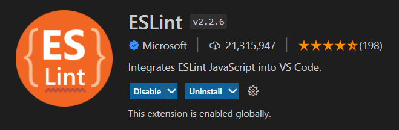
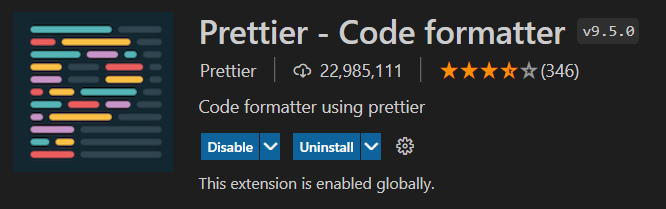
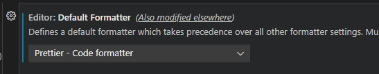

1. VSCode Extensions 열기(`ctrl`+`shift`+`X`)
2. ESlint, Prettier 2가지 Extensions 설치

   - ESLint
     
   - Prettier-Code formatter
     

3. `setting.json` 파일 설정 추가

```json
    "editor.formatOnSave": true,
    "editor.codeActionsOnSave": {
        "source.fixAll.eslint": true
    },
```

4. perference(`shift` + `,`) > 검색창에서 formatter
   Editor: Default Formatter가 prettier로 설정되어 있는지 체크하기.
   안되어 있다면 prettier로 변경
   
